# Eino Agent Visualization

This document visualizes the internal architecture and execution flow of the three Eino agent patterns implemented in this project.

## Overview

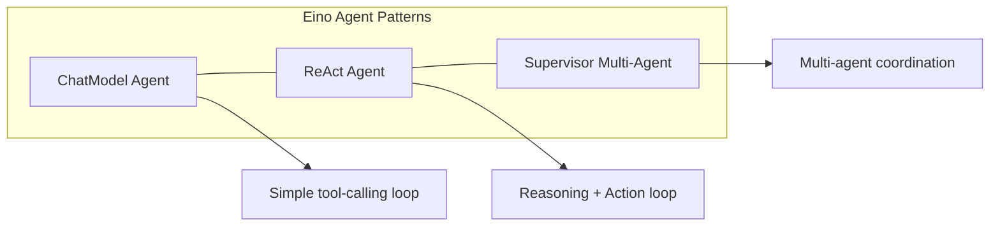

## 1. ChatModel Agent

The ChatModel Agent (`adk.NewChatModelAgent`) is a basic agent that loops between the ChatModel and tools until no more tool calls are produced.

### Internal Graph

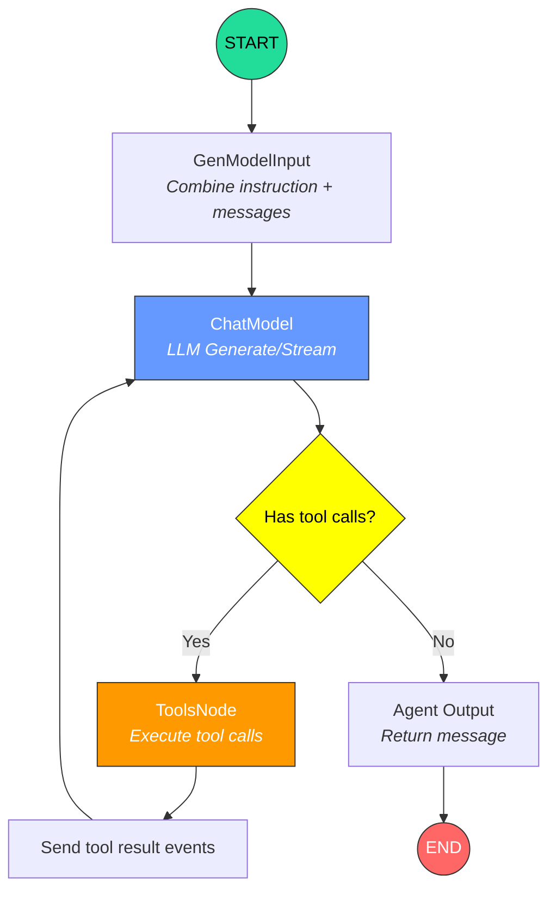

### Execution Flow

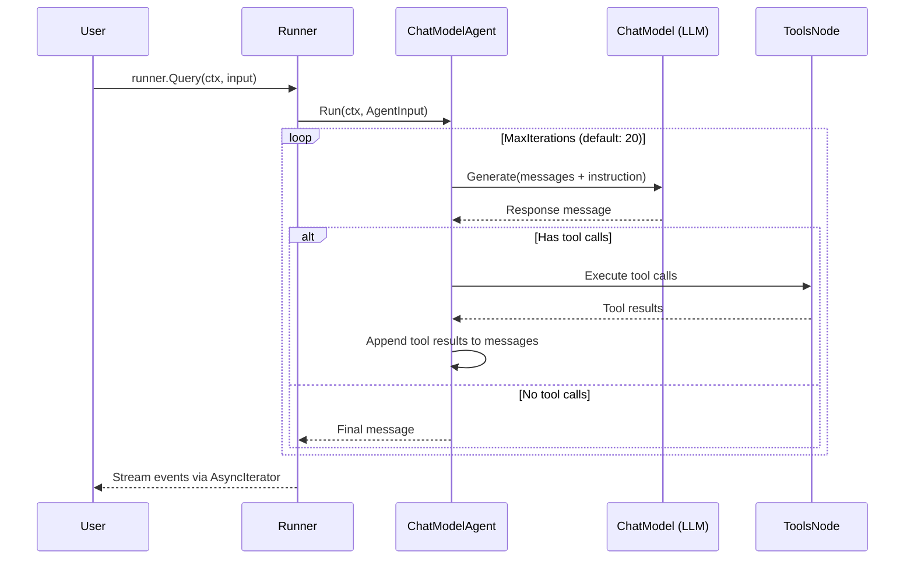

### Code Mapping

| Component | Source | Description |
|-----------|--------|-------------|
| `adk.NewChatModelAgent` | `github.com/cloudwego/eino/adk` | Agent constructor |
| `adk.NewRunner` | `github.com/cloudwego/eino/adk` | Event-driven runner |
| `ToolsConfig` | `compose.ToolsNodeConfig` | Tool registration |
| `utils.InferTool` | `eino/components/tool/utils` | Auto-infer tool schema from function |

### Example: Greeting Agent

```
examples/eino/chatmodel-agent/main.go

OpenAI ChatModel
    ├── Agent: "assistant"
    │   ├── Instruction: "You are a helpful assistant..."
    │   └── Tools:
    │       └── greeting(name) → "Hello, {name}!"
    └── Runner (streaming enabled)
```

---

## 2. ReAct Agent

The ReAct Agent (`react.NewAgent`) implements the Reasoning-Action pattern using a `compose.Graph` with state management. It loops between the ChatModel and tools, with a branch condition that checks for tool calls.

### Internal Graph (compose.Graph)

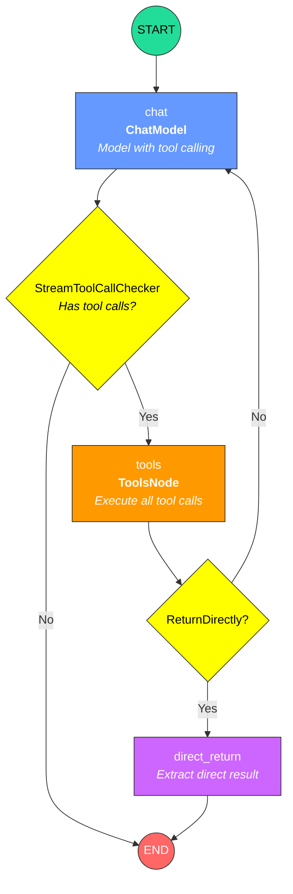

### State Management

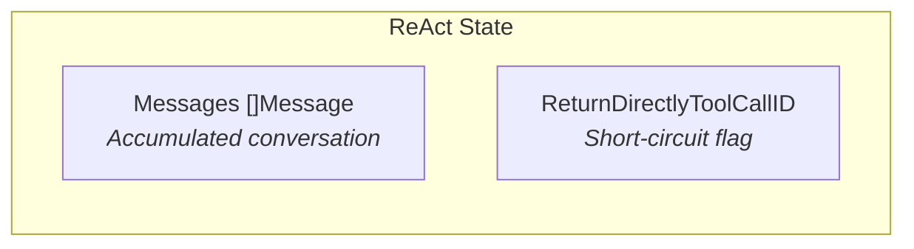

The ReAct agent uses `compose.Graph` local state to track:
- **Messages**: Accumulated message history across all iterations
- **ReturnDirectlyToolCallID**: When set, causes the agent to return the tool result directly

### Node Details

| Node Key | Node Name | Type | Description |
|----------|-----------|------|-------------|
| `chat` | `ChatModel` | `ChatModelNode` | Calls LLM with tool info bound; `modelPreHandle` appends input to state and applies `MessageModifier` |
| `tools` | `Tools` | `ToolsNode` | Executes tool calls from model response; `toolsNodePreHandle` checks for `ReturnDirectly` |
| `direct_return` | - | `LambdaNode` | Extracts the tool result matching `ReturnDirectlyToolCallID` |

### Branch Logic

| From Node | Condition | Target |
|-----------|-----------|--------|
| `chat` | `StreamToolCallChecker` returns true (has tool calls) | `tools` |
| `chat` | No tool calls detected | `END` |
| `tools` | `ReturnDirectlyToolCallID` is set | `direct_return` |
| `tools` | No return-directly flag | `chat` (loop) |

### Execution Flow

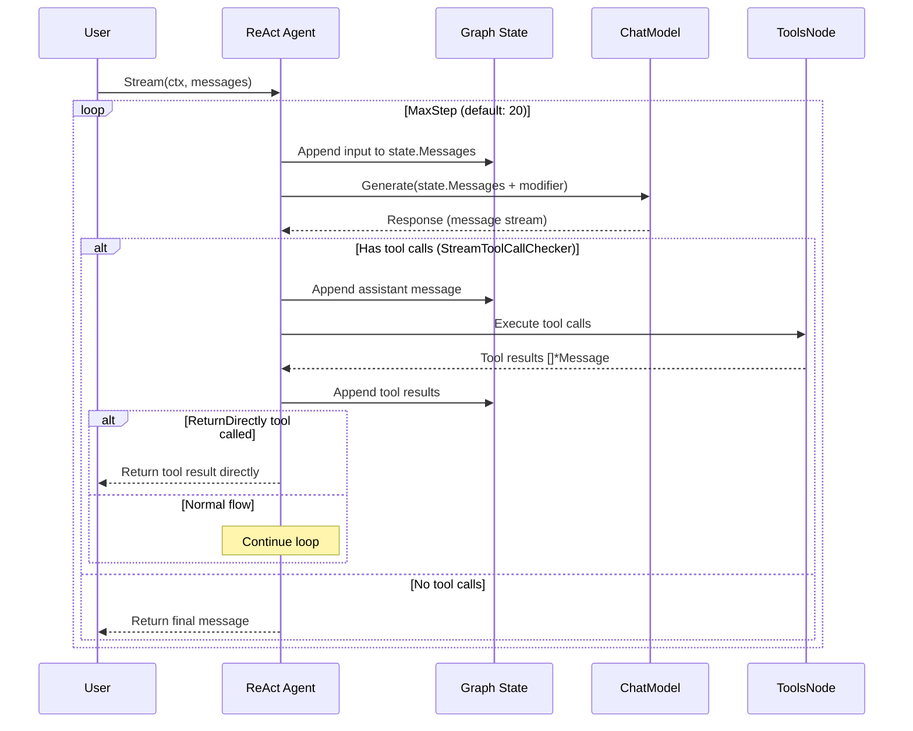

### Example: Calculator Agent

```
examples/eino/react-agent/main.go

compose.Graph[[]Message, Message]
    ├── Nodes:
    │   ├── chat (ChatModel) ← OpenAI gpt-4o with tool calling
    │   ├── tools (ToolsNode) ← calculator tool
    │   └── direct_return (Lambda) ← short-circuit return
    ├── Edges:
    │   ├── START → chat
    │   └── direct_return → END
    ├── Branches:
    │   ├── chat → {tools, END}
    │   └── tools → {chat, direct_return}
    └── Options:
        ├── MaxRunSteps: 20
        └── NodeTriggerMode: AnyPredecessor
```

---

## 3. Supervisor Multi-Agent

The Supervisor pattern (`supervisor.New`) creates a hierarchical multi-agent system where a supervisor agent coordinates sub-agents via `transfer_to_agent` tool calls.

### Architecture

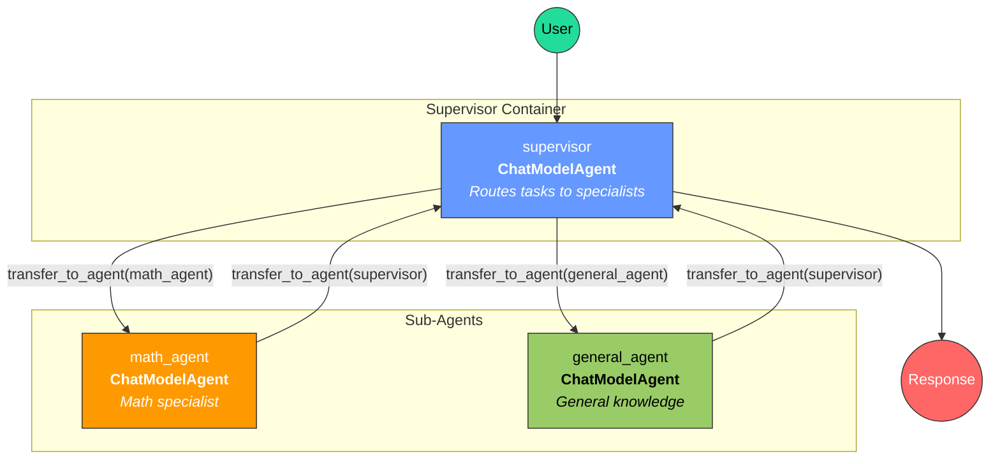

### Transfer Mechanism

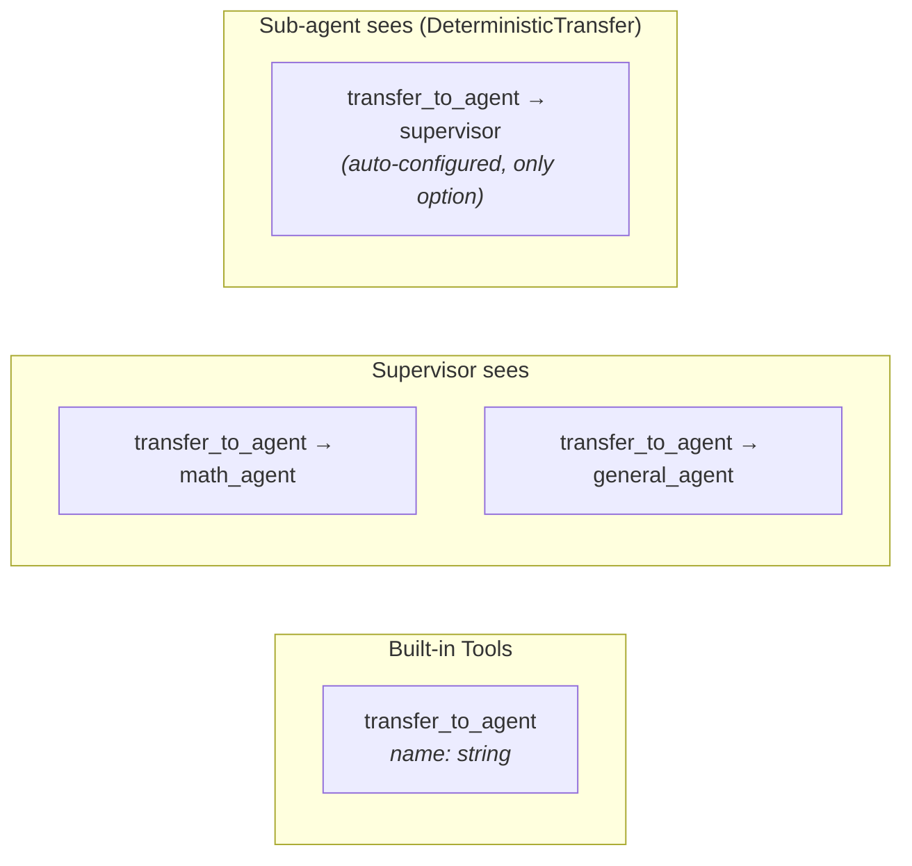

The supervisor pattern works through the ADK's agent transfer mechanism:

1. **Supervisor** gets `transfer_to_agent` tool with all sub-agent names as options
2. **Sub-agents** get `transfer_to_agent` tool via `DeterministicTransferTo`, pre-configured to only transfer back to the supervisor
3. When a transfer tool call is made, the ADK runtime switches execution context to the target agent

### Event Flow

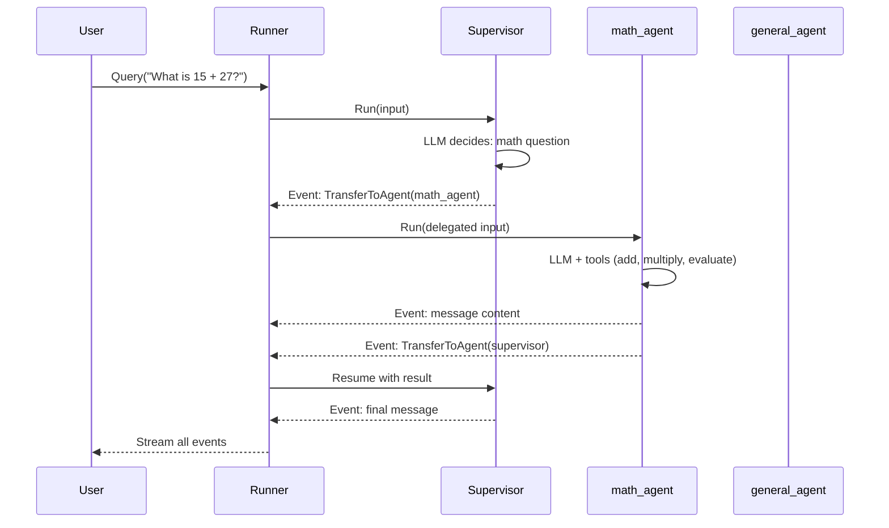

### Agent Hierarchy

```
examples/eino/supervisor/main.go

supervisorContainer (unified tracing)
└── supervisor (ChatModelAgent)
    ├── Instruction: "Route math questions to math_agent..."
    ├── Model: OpenAI gpt-4o
    ├── Sub-agents:
    │   ├── math_agent (ChatModelAgent)
    │   │   ├── Instruction: "You are a math specialist..."
    │   │   ├── Tools:
    │   │   │   ├── add(a, b) → a + b
    │   │   │   ├── multiply(a, b) → a * b
    │   │   │   └── evaluate_expression(expr) → result
    │   │   └── DeterministicTransferTo: [supervisor]
    │   │
    │   └── general_agent (ChatModelAgent)
    │       ├── Instruction: "You are a general knowledge specialist..."
    │       ├── Tools: (none)
    │       └── DeterministicTransferTo: [supervisor]
    │
    └── Runner (streaming enabled)
```

---

## Comparison: Three Agent Patterns

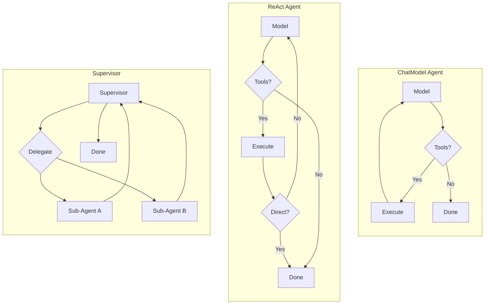

| Feature | ChatModel Agent | ReAct Agent | Supervisor |
|---------|----------------|-------------|------------|
| **Package** | `eino/adk` | `eino/flow/agent/react` | `eino/adk/prebuilt/supervisor` |
| **Graph Type** | Internal loop | `compose.Graph` (explicit) | Agent tree (implicit) |
| **State** | `ChatModelAgentState` | Custom `state` struct | Per-agent state |
| **Max Iterations** | 20 (default) | 12 (default) | Per-agent limits |
| **Tool Support** | Yes | Yes | Per sub-agent |
| **Multi-Agent** | No | No | Yes |
| **Return Directly** | `ToolsConfig.ReturnDirectly` | `ToolReturnDirectly` | N/A |
| **Streaming** | Via Runner | Native `Stream()` | Via Runner |
| **Tracing** | Per-agent callbacks | Graph-level callbacks | Unified container |

---

## Eino Compose Graph Primitives

The Eino agents are built on `compose.Graph`, a stateful directed graph execution engine:

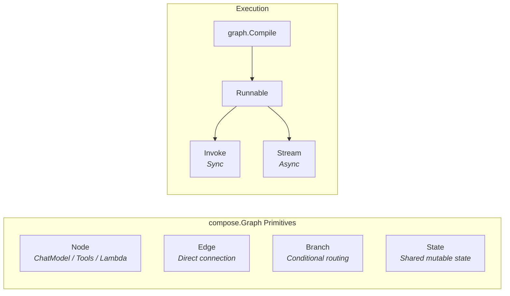

### Key Concepts

- **Node**: A processing unit (ChatModel, ToolsNode, Lambda function)
- **Edge**: Direct connection from one node to another (`AddEdge`)
- **Branch**: Conditional routing based on output inspection (`AddBranch`)
- **State**: Per-run mutable state accessible by all nodes via `compose.ProcessState`
- **Compile**: Converts the graph definition into an executable `Runnable`
- **MaxRunSteps**: Safety limit to prevent infinite loops
- **NodeTriggerMode**: `AnyPredecessor` allows a node to fire when any incoming edge delivers data
